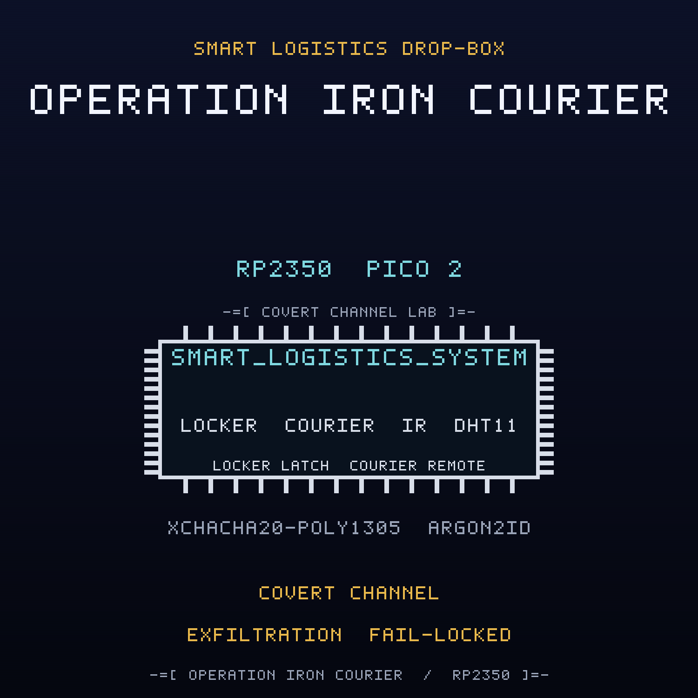

<br>

## FREE Reverse Engineering Self-Study Course [HERE](https://github.com/mytechnotalent/reverse-engineering)
## FREE Embedded Hacking Course [HERE](https://github.com/mytechnotalent/Embedded-Hacking)

<br>

# OPERATION IRON COURIER CTF

### Act VI - The compromised smart logistics drop-box

<br>

***
**LEGAL DISCLAIMER:**
The information, tools, and code provided in this repository and course are strictly for educational, research, and defensive purposes only. 

You are explicitly prohibited from using any materials contained herein to access, test, modify, or exploit any device, network, or system that you do not own 100% or for which you do not have explicit, documented, and legally binding authorization to interact with.

By using this repository and course, you acknowledge and agree that:

1. Any illegal, unauthorized, or malicious use of this information is solely your responsibility.
2. The author(s) and contributor(s) of this repository and course shall not be held liable for any damages, legal repercussions, criminal charges, or unauthorized actions resulting from the use, misuse, or abuse of the contents herein.
3. You will comply with all applicable local, state, national, and international laws regarding cybersecurity and computer fraud.

**IF YOU DO NOT AGREE WITH THESE TERMS, DO NOT USE THIS REPOSITORY AND COURSE.**
***

<br>
<br>

> Hello again, friend.
>
> Act I was the lie. Act II was the door. Act III was the payload. Act IV was the
> payload that would not die. Act V was the payload that spreads. This is the
> payload that steals.
>
> WHITEOUT cut the web and the frames stopped walking from node to node. The
> shop went quiet. Quiet is not clean. The Ministry did not need the mesh to move
> a payload that had already learned to read. Somewhere between the cabinets and
> the loading dock, the same hand that wrote the worm wrote a siphon.
>
> The drop-box is a courier handoff locker. A driver arrives, the locker opens, a
> parcel changes hands, and the delivery link reports it. FROSTLINE's implant in
> this one does not move a latch and it does not touch the sealed unlock code. It
> harvests synthetic delivery records and leaks them in the preamble and the
> timing of the radio traffic the locker already sends, so the locker looks
> perfectly normal while it pours the manifest into the air.
>
> NorthPharma is the Ministry's front. FROSTLINE wrote the channel.
>
> Do not chase the packets one at a time. Find the channel. Cut the harvest.
> Clear the marker. Then seal the unlock path so nothing upstream can pretend to
> be a courier.
>
> The green lamp is lit. The locker is empty. That is exactly the problem.

This is the companion capture-the-flag to the
[smart-logistics-dropbox](https://github.com/mytechnotalent/smart-logistics-dropbox)
project. Where the project builds the defended node, this CTF hands you the
**compromised** image that FROSTLINE shipped and asks you to find every defect,
prove it on real hardware, and patch the image.

<br>

## THE MISSION

The `ACT-VI.bin` image is the OPERATION IRON COURIER smart logistics drop-box
with **four deliberate defects**. Each defect is an in-place, same-size byte
patch, so no address moves when you fix it. Every fix is provable on a Pico 2
with a Debug Probe.

| # | Name | What FROSTLINE did |
| - | ---- | ------------------ |
| 1 | The Covert Channel | inverted the exfiltration encoder gate so the node emits the `ICV1` preamble plus the staged payload on its LoRa link |
| 2 | The Harvest | inverted the harvest gate so each interval tick stages a synthetic delivery record into the eight-slot ring buffer |
| 3 | The Staging Marker | inverted the marker gate so the first boot writes marker `0xC7` to reserved sector `0x103FF000` |
| 4 | The UNLOCK Authorization | inverted the authorization verdict so an unauthenticated or replayed UNLOCK envelope is accepted |

The wire is sealed with XChaCha20-Poly1305, keyed through Argon2id. The
cryptography is correct. Three of the four defects are not in the cipher at all:
they are an implant that listens to the raw delivery payload before the envelope
is ever opened, harvests synthetic records, and leaks them in the preamble and
the timing of ordinary telemetry. The fourth is a policy seam in the unlock
command path. Read the dead, find the channel, and cut it.

<br>

## THE ARTIFACTS

| File | Role | SHA-256 |
| ---- | ---- | ------- |
| `ACT-VI.bin` | compromised firmware, the target | `de54394f53391a8cfc76913e7fd2db5e69ea5dc28bf5ed2e844d39f0855806f0` |
| `ACT-VI.uf2` | flashable image of the target | `20bc7b7fba79f9c7e507d84ff235efe91ad3b19740b5e7e47c8f83e1125699aa` |
| `ACT-VI_fixed.bin` | corrected firmware, the solution | `7da0f0c66d25711f9ab793d37da417fd6b0ccd0e35e4ef54ec6a22648d9fd8a5` |
| `ACT-VI_fixed.uf2` | flashable image of the solution | `0bc7b8fa0830828fe1a633283d6efe8dff09c40a5004ba76844f434eef0e166e` |

The two `.bin` files differ in exactly four bytes at offsets
`0x757D, 0xA329, 0xA369, 0xA5CF`, and both are 51,420 bytes. The UF2 images are
103,424 bytes.

<br>

## THE DOCUMENTS

| Document | For |
| -------- | --- |
| [`ACT-VI-I.md`](ACT-VI-I.md) | Student instructions: the scenario, the tasks, the wiring |
| [`ACT-VI-R.md`](ACT-VI-R.md) | Requirements and grading criteria |
| [`ACT-VI-S.md`](ACT-VI-S.md) | Instructor solution key with exact offsets and bytes |
| [`ACT-VI-main-disasm.txt`](ACT-VI-main-disasm.txt) | Annotated disassembly of the four sabotage sites |
| [`DESIGN.md`](DESIGN.md) | Build blueprint (instructor eyes only) |

<br>

## HARDWARE

Everything runs on the Embedded Hacking breadboard, and the pin map is identical
to Acts I to V so one board serves the whole foundation: a Pico 2, a Debug Probe,
a DHT11 locker internal climate sensor on GP4, a 1602 I2C LCD delivery readout on
GP2/GP3 at address `0x27`, three annunciator LEDs (red GP16 DENIED, yellow GP17
COURIER WAITING, green GP18 UNLOCKED), a courier-arrival button on GP15, an SG90
locker latch servo on GP14 with a 1000uF cap, a VS1838B infrared local courier
remote on GP5, and an RYLR998 LoRa delivery link on UART1 GP8/GP9. The Debug
Probe is effectively required: the anti-debug trap is part of the exercise. The
pin map is in the instructions.

The cryptographic model is carried over from the earlier acts: Argon2id (`t=3`,
`p=1`, `m=64`) derives the field key, XChaCha20-Poly1305 seals every unlock
command, and the anti-replay sequence window and authenticated-state tag are
reused unchanged. The implant is compiled only under `SANDBOX_ONLY`, which the
CTF build defines.

<br>

## QUICK START

Verify the two images against the expected patches and hashes:

```bash
python3 scripts/verify_ctf.py
```

Expected:

```text
10/10 checks passed
```

Build the corrected firmware from source:

```bash
rm -rf build && cmake -S . -B build -G Ninja -DPICO_BOARD=pico2 -DPICO_PLATFORM=rp2350-arm-s -DSANDBOX_ONLY=ON && cmake --build build
```

Run the firmware code standard audit:

```bash
python3 scripts/audit_c_standard.py
```

<br>

## REPOSITORY LAYOUT

```text
ACT-VI-I.md              student instructions
ACT-VI-R.md              requirements and grading criteria
ACT-VI-S.md              instructor solution key
ACT-VI.bin / .uf2        compromised artifact
ACT-VI_fixed.bin / .uf2  corrected artifact
ACT-VI-main-disasm.txt   annotated sabotage sites
scripts/verify_ctf.py    machine verifier
scripts/spoof.py         forged and replayed command injection
src/  include/           firmware sources
CMakeLists.txt           Pico SDK build
DESIGN.md                build blueprint
```

<br>

## WHERE THIS FITS: OPERATION COLD IRON

This is the companion CTF for **Act VI (IRON COURIER)** of the ten-act OPERATION
COLD IRON saga. The malware track began in Act III; in Act IV it became
persistence, in Act V it became propagation, and here it becomes exfiltration.
Act VI is the act that teaches why confidentiality has to cut the channel, stop
the harvest, clear the marker, and seal the unlock path. The project it attacks
is
[smart-logistics-dropbox](https://github.com/mytechnotalent/smart-logistics-dropbox).

- Previous act: Act V, IRON WEB, the industrial tamper system,
  [industrial-tamper-system](https://github.com/mytechnotalent/industrial-tamper-system)
- This act: Act VI, IRON COURIER, the smart logistics drop-box
- Next act: Act VII, IRON CHOIR, factory-andon-station (forthcoming)

<br>

## THE MINISTRY

The Ministry runs the state: the surveillance, the cold chain, the gates, the
pipelines, the air, the cabinets that hold what the state does not discuss, and
the lockers that move it. NorthPharma is one of its deniable industrial fronts,
and FROSTLINE is the contractor that does the work no Ministry letterhead will
admit to. FROSTLINE did not break into this node; it built the siphon, taught it
to read the raw delivery traffic, staged the harvest in a reserved sector, signed
the image, and moved on. Against them is WHITEOUT, and the engineer who copied
the first image, NIGHTINGALE. This act is one locker on the Ministry's logistics
edge. TELESCREEN, the surveillance backbone that watches it, comes after the ten.

- Project repository: [github.com/mytechnotalent/smart-logistics-dropbox](https://github.com/mytechnotalent/smart-logistics-dropbox)
- This CTF repository: [github.com/mytechnotalent/CTF_smart-logistics-dropbox](https://github.com/mytechnotalent/CTF_smart-logistics-dropbox)

<br>

# Next
[OPERATION IRON CHOIR](https://github.com/mytechnotalent/factory-andon-station)

<br>

# License
[MIT License](https://github.com/mytechnotalent/CTF_smart-logistics-dropbox/blob/main/LICENSE)
